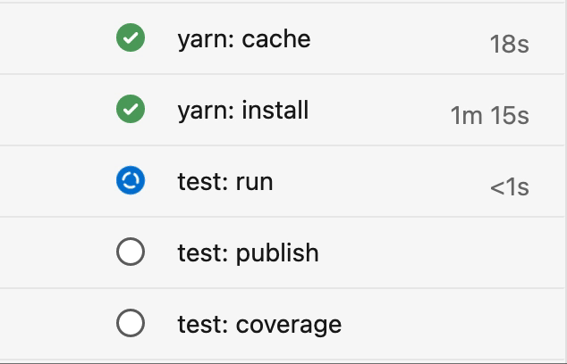

# jest-ado-reporter

[![github actions build][img:gh-build]][url:gh-build]
[![code coverage][img:codecov]][url:codecov]

Reports jest test suite progress information to the pipeline step in Azure DevOps. Useful for displaying progress when you have a lot of tests to run.

&nbsp;



&nbsp;

## Installation

Add the dependency to your application.

```bash
npm i --save-dev jest-ado-reporter
# - or -
yarn add -D jest-ado-reporter
```

You can then add the reporter to your jest configuration (e.g.: `jest.config.ts`)

```javascript
import type { Config } from "jest";

const config: Config = {
  reporters: ["default", "jest-ado-reporter" /* add this */],
};

export default config;
```

&nbsp;

## Options

### enabled

Type of `boolean`.

The reporter will only output logging commands when running in a Azure DevOps pipeline. If you would like to force this locally for debugging purposes, you can set the `enabled` option to `true`.

Example:

```javascript
['jest-ado-reporter', { enabled: true }],
```

Output locally, when used in parallel with the `default` reporter:

```bash
$ jest
##vso[task.setprogress value=1;]jest
 PASS   test5.spec.tsx
##vso[task.setprogress value=17;]jest
 PASS   test2.spec.tsx
##vso[task.setprogress value=34;]jest
 PASS   test4.spec.tsx
 PASS   test3.spec.ts
##vso[task.setprogress value=50;]jest
##vso[task.setprogress value=67;]jest
 PASS   test1.spec.ts
##vso[task.setprogress value=84;]jest
 PASS   test6.spec.tsx
##vso[task.setprogress value=99;]jest

Test Suites: 6 passed, 6 total
Tests:       18 passed, 18 total
Snapshots:   0 total
Time:        5.617 s
Ran all test suites.
✨  Done in 9.97s.
```

[img:codecov]: https://codecov.io/gh/bashaus/jest-ado-reporter/graph/badge.svg?token=TCOLK6IK7J
[url:codecov]: https://codecov.io/gh/bashaus/jest-ado-reporter
[img:gh-build]: https://github.com/bashaus/jest-ado-reporter/actions/workflows/build.yml/badge.svg
[url:gh-build]: https://github.com/bashaus/jest-ado-reporter/actions/workflows/build.yml
